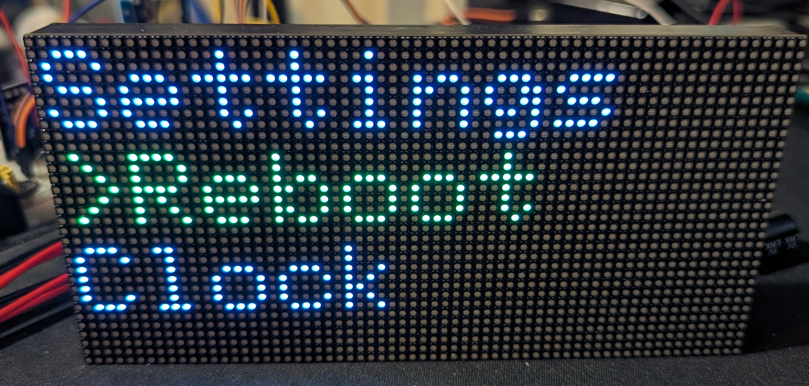
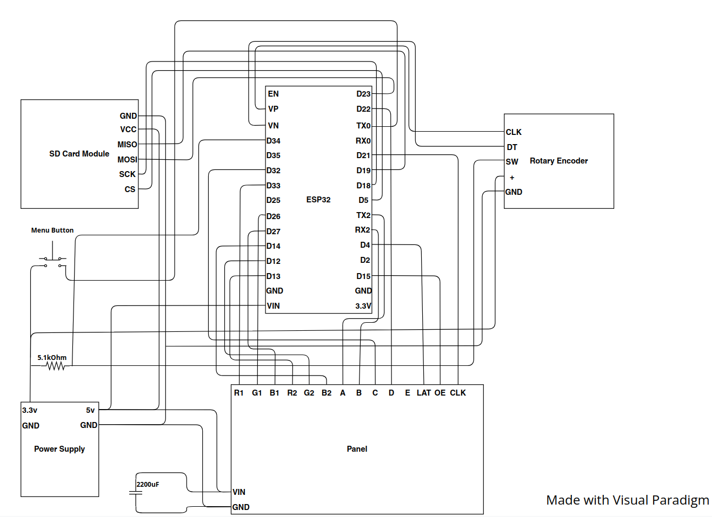
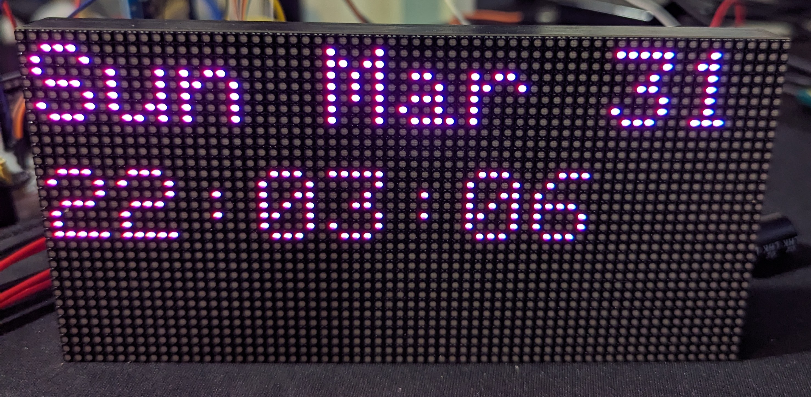
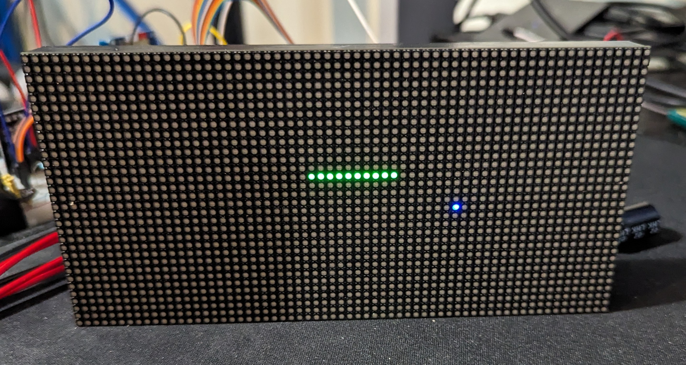
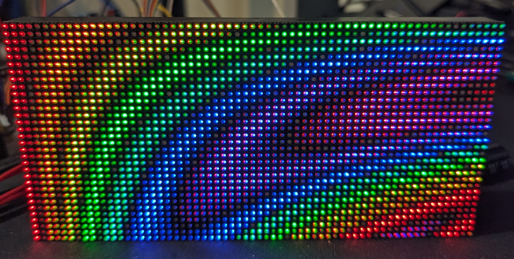

# LedPanelOS *(Name Pending)*
# Current Version: 0.1.0
# Introduction

This is just a little pet project of mine. The goal is to have a little stock-ticker like device that can sit on your desk and do neat things like show you live sports scores, track the prices of stocks, or simply display the time. It has an SD card reader to store config and user data through reboots.
# Getting Started
## Hardware
### Supported Hardware
As of right now, an ESP32 (Original ESP WROOM 32) is being used as the brains. The ESP32-S2 and ESP32-S3 should also work fine, but have not been tested yet. A generic 32x64 LED panel used as display. Any one with **THIS** connector at the back should work fine. Other hardware used includes an SD card reader, a simple push button, and a rotary encoder with push button. Any generic component should work fine for these.
### Wiring Diagram

Note the 2200uF capacitor between the vin and ground of the panel is there because I initially had issues with the screen flickering. This did not solve it, but apparently helps smooth any voltage spikes to the panel helping reduce any potential for flickering.  
Speaking of flickering, whenever any wifi operations are done, some bits are outputted on certain pins of the ESP32 making them unsuitable for use as output pins. However, I haven't had any issue using them as input.
### Power
The ESP32 requires 3.3V input to operate. However, most of the development kits have a built in voltage regulator making it fine to supply 5V. The LED Panel should require a 5V input to power. I am currently using on of those generic breadboard power supplies that they bundle with Arduino starter kits, because it lets me easily have both 5V and 3.3V power rails. The 3.3V rail is very important in this case as its used for the rotary encoder and menu button, because supplying more than 3.3V to an input pin on the ESP32 will damage it (Trust me).   
## Software
### OS
Everything is written in C++. I plan in the future to use a legitimate RTOS to better schedule any of the tasks, but as of right now everything is timed using silly `delay()` arithmetic. 
### Config files
There are config files on the SD card, so that you don't have to reflash the board to make a small change for something like changing what WiFi network the board uses. Modify these files to configure your panel.
- **wifi.conf**: Stores WiFi SSID and passwords
- **time.json**: Stores time related settings like timezone
### How to flash ESP32
Here is a very quick guide on how to flash the ESP32 with this software.
1. **Install the Arduino IDE**: You can find this through Google. Download it and set it up.
2. **Open the Code**: You can download this software from the Github page. extract the .zip file, and open it in the IDE.
3. **Setup SD Card**: Copy and paste the contents of the `./SD` folder to an SD card, and insert it into the module. The SD has to be formatted as FAT32, and be <=32GB.
4. **Select Correct Board**: In the IDE, go to `Tools > Board > Board Manager`. There, select ESP32 and download. Then, go back to `Tools > Boards` and select ESP32.
5. **Install Required Libraries**: For this to compile, you need to install all of the required libraries. They are all listed at the bottom of this ReadMe. Go to `Tools > Manage Libraries` and download the libraries.
6. **Verify Code**: Once the libraries are downloaded, press the verify button to ensure that the code compiles successfully
7. **Flash Board**: Once verified, connect your ESP32 to your computer via the Micro USB on the board (If youre using the raw ESP32 and not a dev kit I'm assumming you know what you're doing). Try to do this either with the board not connected to the panel, or with the board being powered by the power supply. We just want to avoid powering the panel via your computers usb port, as it aparently draws a lot of power and may damage something. In `Tools > Port`, select the correct port your board is connected to. Finally, select upload. If successful, connect everything and voila!
## Applications
From the main screen after booting, you can select whatevery app to run. You can return to the menu by pressing the menu button
### Current Apps
- **Clock**: Displays date and time 
- **Settings**: Modify certain system settings or run some tests
- **Snake**: A little snake game :) 
- **Plasma**: Cool lavalamp-like visuals. Ripped directly from an example sketch for the panel display library I'm using. 
More coming in the future.
### How to add an app
To add an app. first create a `<appname>.h` file in the root directory of the project. Next, use the template in `sample.h` to make your app. Note that the main function must return void and take no arguments. When done, add `#include "<appname>.h"` to the `app.h` file. Finally, in `main.ino`, add your app in the `menuItems` array, by supplying its name, and the name of its function. These names are limited to 9 characters long.    
If your app needs assets, consider putting them on the SD card in a folder with the application name, and loading them only when needed.
### Converting images for display
To display images on the board, I currently use a little command line utility I wrote to convert a .bmp image to a struct that can be passed to a function to display it to the screen. The tool is located in `./tools/bitmap/convert4esp32` as an executable. You can just run it from the command line. The tool is written in Go, so if I havent compiled it for your system you can very easily do that yourself as the source code is included. 
# Further Information
## Why did you do *x* like this? Wouldn't it be faster/better/safer to do it like *this* instead?
Probably.
## The Arduino IDE is giving me an error when I try to flash the board, how do I fix it?
Your best bet is to google any errors you get. If you're not using the lastest version, the code should compile. Be sure to check that all libraries are installed, and try upgrading/downgrading those libraries if you're having issues with them. If you believe it's an issue with the code itself, please reach out to me and let me know.
## Can I use a different microcontroller for this? How about an Arduino UNO? A RaspberryPi? ESP8266?
Only the ESP32 will work directly out of the box with this code. It is **HIGHLY** dependent on [*this*](https://github.com/mrfaptastic/ESP32-HUB75-MatrixPanel-DMA) library for the graphics interface, which only supports the ESP32. If you want to port this to work with another microcontroller, you will have to completely replace the graphics interface which at that point just start your own thing from scratch. Keep in mind that for whatever you use, you'll need enough IO pins for the panel, buttons, and SD card reader. Also, microcontrollers like the Arduino UNO have a very small amount of SRAM on them, meaning they will most likely not be suitable for this type of project.
## Can I use a bigger LED panel? How about chaining multiple together?
It's currently unsupported. everything is made to run on one 32x64 display, it would look/act weird on anything else.
## Can I use this code in my own project?
Definitely feel free to use and/or modify this code to suit your personal needs! However, you may **NOT** monetize any project that uses this code, in full or in part. Keep in mind that this project also uses many libraries, and that you should make sure that you have permissions to use those in whatever way you need to.
# Thanks
The following libraries were used to project. Thank you so much!
# Changelog
## 0.1.0
- Inital beta release
- Added Clock app
- Added Snake app
- Added Plasma app
- Added rotary enncoder testing app to test input functionality
